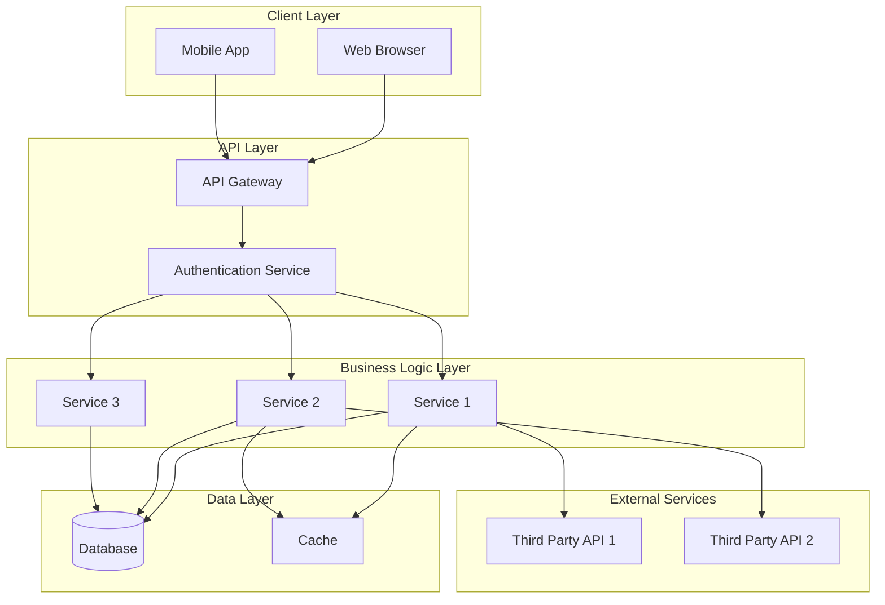

# ellamira

## Architecture Overview

### Architecture Components

- **Client Layer**: Web and mobile interfaces that users interact with
- **API Layer**: Gateway and authentication services that handle incoming requests
- **Business Logic Layer**: Core services that implement business logic
- **Data Layer**: Database and caching systems for data persistence
- **External Services**: Third-party APIs and integrations

### Getting Started

Add project setup instructions here.

### Contributing

Add contribution guidelines here.

### License

Add license information here.
