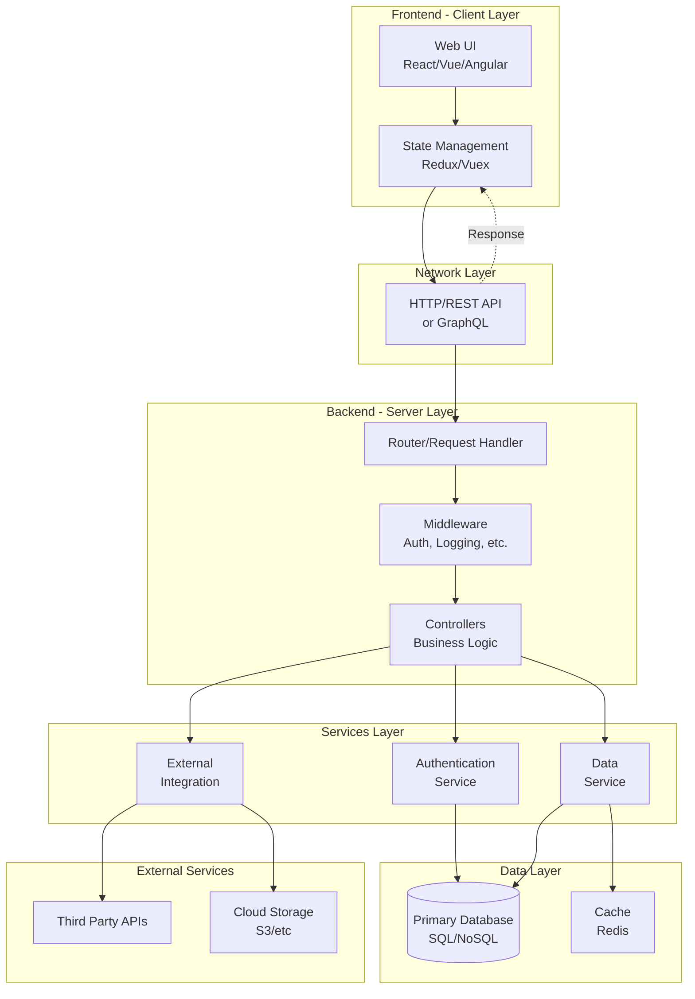

# ellamira

## Architecture Overview

### Architecture Layers

#### Frontend (Client)
- **Web UI**: User interface built with modern frameworks
- **State Management**: Manages application state and data flow

#### Network
- **HTTP/REST API or GraphQL**: Communication protocol between frontend and backend

#### Backend (Server)
- **Router**: Handles incoming requests and routes them to appropriate handlers
- **Middleware**: Cross-cutting concerns like authentication, logging, rate limiting
- **Controllers**: Implements business logic and orchestrates services

#### Services
- **Authentication Service**: Manages user authentication and authorization
- **Data Service**: Handles data operations and business logic
- **External Integration**: Manages third-party service integrations

#### Data
- **Primary Database**: Persistent data storage
- **Cache**: In-memory caching for performance optimization

#### External Services
- **Third Party APIs**: Integration with external services
- **Cloud Storage**: File storage and media management

### Getting Started

Add project setup instructions here.

### Contributing

Add contribution guidelines here.

### License

Add license information here.
